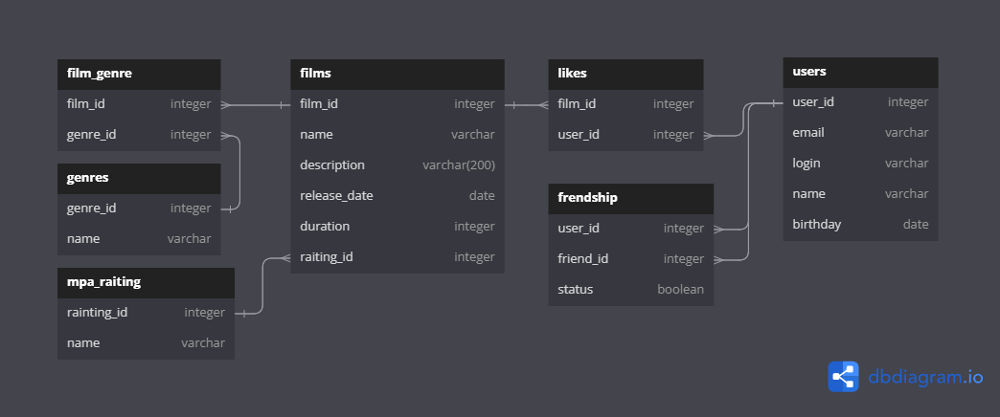

# Project java-filmorate
## Приложение Filmorate: Оценка фильмов по рейтингу
### _ТЗ 11 - промежуточное задание_ 
### ER Диаграмма Filmorate:


[_Ссылка на ER диаграмму!_](src/main/resources/scheme/ER_Scheme.png) 

[_Ссылка на диаграмму в редакторе!_](https://dbdiagram.io/d/65db3b3b5cd0412774c0f72a)
> [!NOTE]
> ### Описание ER диаграммы Filmorate:
* Таблица `users` - модель пользователя
* Таблица `friendship` - инфо о дружбе между двумя пользователями.
  Если статус не подвержден: столбец status - false, подвержден - true
* Таблица `films` - модель фильма
* Таблица `likes` - инфомация о пользователях поставивших лайк фильму
* Таблица `film_genre` - информация о жанрах фильма
* Таблица `genres` - список жанров
* Таблица `mpa_raiting` - информация о  возрастном ограничении для фильма
> [!IMPORTANT]
> ### Проверка работоспособности связей в таблице при помощи [SQL Database Playground](https://www.db-fiddle.com)
```
CREATE TABLE users  (
user_id INT,
email varchar,
login varchar,
name varchar,
birthday date
);

INSERT INTO Users (user_id, email, login, name, birthday) 
VALUES (1, 'professor@yandex.ru', 'Professor', 'Max', '1994-05-04');

INSERT INTO Users (user_id, email, login, name, birthday) 
VALUES (2, 'Ponchik@yandex.ru', 'Donut', 'Ponya', '2023-02-27');

CREATE TABLE Films   (
film_id integer,
name varchar,
description varchar,
release_date date,
duration INT,
raiting_id INT
);
INSERT INTO Films (film_id, name, description, release_date, duration, raiting_id) 
VALUES (1, '12 Angry Men', 'A film about fair choice and honesty', '1957-04-24', 200, 2);
INSERT INTO Films (film_id, name, description, 
release_date, duration, raiting_id) 
VALUES (2, 'Loving Vincent', 'A film about the fate of the artist Vincent Van Gogh ', '2017-04-24', 180, 3);

CREATE TABLE Likes (
film_id INT,
user_id INT
);
INSERT INTO Likes (film_id, user_id) VALUES (1, 1);
INSERT INTO Likes (film_id, user_id) VALUES (1, 2);
```

> [!IMPORTANT]
> Примеры запросов для основных операций приложения:

- [x] **USER** 
1. Получение списка всех пользователей:
```
 SELECT *
 FROM Users;
```
2. Получение информации о пользователе по ID:
```
   SELECT *
   FROM users
   WHERE user_id = 1;
```
3. Получение списка n пользователей по убыванию в лексикографическом порядк 
_(где n, LIMIT выводимых объектов таблицы)_
```
   SELECT name
   FROM users
   ORDER BY name DESC
   LIMIT 5;
```
- [x] **FILM**

1. Получение списка всех фильмов:
```
   SELECT *
   FROM films;
```
2. Получение информации о фильме по ID:
```
   SELECT *
   FROM films
   WHERE film_id = 1
```
3. Выборка 7 новых фильмов по году выпуска:
```
  SELECT name,
   EXTRACT(YEAR FROM CAST(release_date AS date))
   FROM films
   ORDER BY release_date DESC
   LIMIT 7;
```