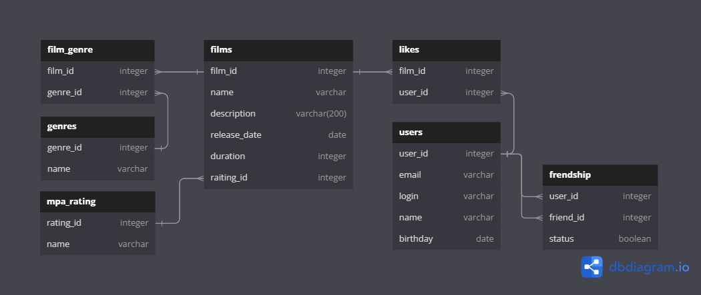

# Project java-filmorate
## Приложение Filmorate: Оценка фильмов по рейтингу
### _ТЗ 11 - промежуточное задание_
### ER Диаграмма Filmorate:


[_Ссылка на ER диаграмму!_](src/main/resources/scheme/ER_Scheme.png)

[_Ссылка на диаграмму в редакторе!_](https://dbdiagram.io/d/65db3b3b5cd0412774c0f72a)
> [!NOTE]
> ### Описание ER диаграммы Filmorate:
* Таблица `users` - модель пользователя
* Таблица `friendship` - инфо о дружбе между двумя пользователями.
  Если статус не подвержден: столбец status - false, подвержден - true
* Таблица `films` - модель фильма
* Таблица `likes` - инфомация о пользователях поставивших лайк фильму
* Таблица `film_genre` - информация о жанрах фильма
* Таблица `genres` - список жанров
* Таблица `mpa_rating` - информация о  возрастном ограничении для фильма
> [!IMPORTANT]
> ### Проверка работоспособности связей в таблице при помощи [SQL Database Playground](https://www.db-fiddle.com)
> #### _(Помните, что запуск базы данных производится на PostgreSQL v15!)_
```SQL
-- Create tables
CREATE TABLE users (
    user_id INT,
    email varchar,
    login varchar,
    name varchar,
    birthday date
);

CREATE TABLE films (
    film_id integer,
    name varchar,
    description varchar,
    release_date date,
    duration INT,
    rating_id INT
);

CREATE TABLE friendship (
    user_id integer,
    friend_id integer,
    status boolean
);

CREATE TABLE likes (
    film_id INT,
    user_id INT
);

CREATE TABLE genres (
    genre_id integer,
    name varchar
);

CREATE TABLE film_genre (
    film_id integer,
    genre_id integer
);

CREATE TABLE mpa_rating (
    rating_id integer,
    name varchar            
);

-- Insert data
INSERT INTO users (user_id, email, login, name, birthday) 
VALUES (1, 'professor@yandex.ru', 'Professor', 'Max', '1994-05-04');

INSERT INTO users (user_id, email, login, name, birthday) 
VALUES (2, 'Ponchik@yandex.ru', 'Donut', 'Ponya', '2023-02-27');

INSERT INTO films (film_id, name, description, release_date, duration, rating_id) 
VALUES (1, '12 Angry Men', 'A film about fair choice and honesty', '1957-04-24', 200, 2);

INSERT INTO films (film_id, name, description, release_date, duration, rating_id) 
VALUES (2, 'Loving Vincent', 'A film about the fate of the artist Vincent Van Gogh ', '2017-04-24', 180, 3);

INSERT INTO friendship (user_id, friend_id, status) VALUES (1, 2, true);

INSERT INTO friendship (user_id, friend_id, status) VALUES (2, 1, true);

INSERT INTO likes (film_id, user_id) VALUES (1, 1);

INSERT INTO likes (film_id, user_id) VALUES (1, 2);

INSERT INTO genres (genre_id, name) VALUES (1, 'Комедия');

INSERT INTO genres (genre_id, name) VALUES (2, 'Драма');

INSERT INTO genres (genre_id, name) VALUES (3, 'Мультфильм');

INSERT INTO genres (genre_id, name) VALUES (4, 'Триллер');

INSERT INTO genres (genre_id, name) VALUES (5, 'Документальный');

INSERT INTO genres (genre_id, name) VALUES (6, 'Боевик');

INSERT INTO film_genre (film_id, genre_id) VALUES (1, 1);

INSERT INTO mpa_rating (rating_id, name) VALUES (1, 'G');

INSERT INTO mpa_rating (rating_id, name) VALUES (1, 'PG');

INSERT INTO mpa_rating (rating_id, name) VALUES (1, 'PG-13');

INSERT INTO mpa_rating (rating_id, name) VALUES (1, 'R');

INSERT INTO mpa_rating (rating_id, name) VALUES (1, 'NC-17');

```

> [!IMPORTANT]
> Примеры запросов для основных операций приложения:


- [x] **USER**

<details>
<summary><h4> 1. Получение списка всех пользователей: </h4></summary>

```SQL
SELECT *
FROM users;
```
</details>
<details>

<summary><h4> 2. Получение информации о пользователе по ID: </h4></summary>

```SQL
SELECT *
FROM users
WHERE user_id = 1;
```
</details>
<details>
<summary><h4> 3. Получение списка n пользователей по убыванию в лексикографическом порядк
_(где n, LIMIT выводимых объектов таблицы)_ </h4></summary>

```SQL
SELECT name
FROM users
ORDER BY name DESC
LIMIT 5;
```
</details>
<details>
<summary><h4> 4. Получение списка друзей </h4></summary>

```SQL
SELECT *
FROM friendship;
```
</details>
<details>
<summary><h4> 5. Получение списка друзей у конкретного пользователя </h4></summary>

```SQL
SELECT u.name
FROM users AS u
INNER JOIN friendship AS f ON u.user_id = f.friend_id
WHERE f.user_id = 1;
```
</details>
<details>
<summary><h4> 6. Получение общего списка друзей </h4></summary>

```SQL
SELECT * 
FROM users 
WHERE user_id IN (SELECT friend_id FROM friendship WHERE user_id = 1) 
AND user_id IN (SELECT friend_id FROM friendship WHERE user_id = 2);
```
</details>


- [x] **FILM**

 <details>
<summary><h4> 1. Получение списка всех фильмов: </h4></summary>

```SQL
   SELECT *
   FROM films;
```
</details>
<details>
<summary><h4> 2. Получение информации о фильме по ID: </h4></summary>

```SQL
   SELECT *
   FROM films
   WHERE film_id = 1
```
</details>
<details>
<summary><h4> 3. Выборка 7 новых фильмов по году выпуска: </h4></summary>

```SQL
  SELECT name,
   EXTRACT(YEAR FROM CAST(release_date AS date))
   FROM films
   ORDER BY release_date DESC
   LIMIT 7;
```
</details>
<details>
<summary><h4> 4. Вывод спаска всех жанров </h4></summary>

```SQL
  SELECT * 
  FROM genres;
```
</details>
<details>
<summary><h4> 5. Вывод названиее фильма и его жанра </h4></summary>

```SQL
  SELECT films.name AS film_name,
		 genres.name AS genre_name
FROM film_genre
JOIN genres ON film_genre.genre_id = genres.genre_id
JOIN films ON film_genre.film_id = films.film_id
WHERE film_genre.film_id = 1;
```
</details>

<details>
<summary><h4> 6. Вывод 5 самых популярных фильмов </h4></summary>

```SQL
SELECT films.name, COUNT(likes.film_id) as likes_count
FROM films
JOIN likes ON films.film_id = likes.film_id
GROUP BY films.name
ORDER BY likes_count DESC
LIMIT 5;
```
</details>
